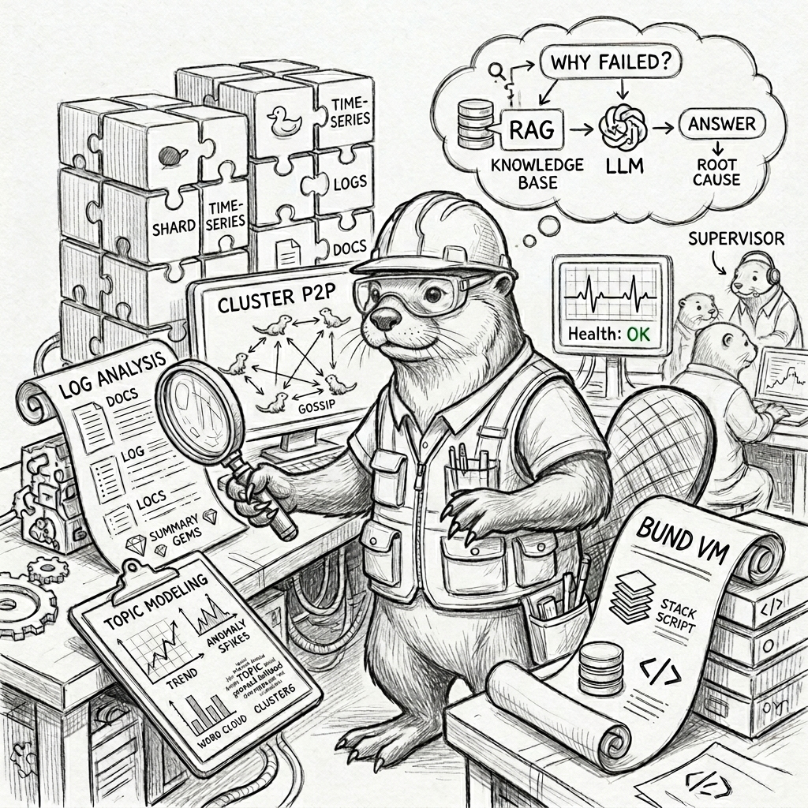

# bdslib — BUND Data Storage

A Rust library (Edition 2024) for multifunctional programmatic data storage.
bdslib combines time-series telemetry, full-text and semantic search, log
analysis, extractive text summarisation, root cause analysis, a document
knowledge base, statistical trend analysis, and a stack-based scripting
runtime into a single cohesive system backed by DuckDB.

---

## Capabilities

### Storage

| Capability | Description |
|---|---|
| **Time-series shards** | DuckDB partitioned by configurable time windows; LRU shard cache; R2D2 connection pool |
| **Observability records** | Primary / secondary record model with redb-backed deduplication fingerprinting |
| **Document knowledge base** | Metadata (JSON) + raw content (BLOB) + per-document HNSW vector index; chunked file ingestion |
| **Frequency tracking** | `(timestamp, id)` observation store for event-rate analysis over time |
| **Signal store** | Named severity signals with arbitrary metadata and semantic search |
| **Result queues** | Per-id FIFO queues of `rust_dynamic` values with TTL eviction; backs async BUND job results |

### Search

| Capability | Description |
|---|---|
| **Semantic vector search** | fastembed AllMiniLML6V2 embeddings stored in per-shard HNSW indexes (VecStore) |
| **Full-text search** | Tantivy BM25 index per shard |
| **Aggregation search** | Single call combining cross-shard vector search over telemetry + semantic document store search |

### Log analysis

| Capability | Description |
|---|---|
| **Syslog ingestion** | RFC 3164 parser — timestamp, host, facility, severity, message; bulk file ingest |
| **Drain3 template mining** | Prefix-tree log clustering into drain3 templates; per-shard template store with HNSW search |
| **LDA topic modelling** | Latent Dirichlet Allocation over a key's corpus; per-key and all-keys variants |

### Extractive summarisation

| Capability | Description |
|---|---|
| **TextRank** | PageRank over pairwise cosine similarity; summarises sentences, log lines, or JSON fingerprints |
| **LSA** | Latent Semantic Analysis (Steinberger-Ježek 2004): TF-IDF → centred Gram → truncated SVD → concept-space scoring |
| **Template TextRank** | TextRank over drain3 template bodies observed in a time window |
| **Primary TextRank** | TextRank over primary record text bodies (`data["value"]` / `data["raw"]`), skipping numeric measurements |
| **Primary LSA** | LSA variant of primary summarisation — same body extraction rule, SVD-based ranking |

### Statistical analysis & RCA

| Capability | Description |
|---|---|
| **Telemetry trends** | Min, max, mean, median, std-dev, S-H-ESD anomaly detection, breakout detection |
| **Root cause analysis** | G-Forest co-occurrence clustering over non-telemetry events; causal ranking by lead time |
| **Template RCA** | RCA on drain3 template observations — cluster template bodies by co-occurrence |

### Scripting runtime

| Capability | Description |
|---|---|
| **BUND VM** | Stack-based scripting language with full stdlib; stateful named contexts; `v2/eval` RPC |
| **BUND worker pool** | Process-wide pool of threads each running an independent Bund VM; jobs submitted via crossbeam MPMC channel; results written to global result queues |
| **Async eval** | `v2/eval.queued` — submit a BUND script, get a UUIDv7 job handle immediately, poll results via `v2/results.*` |

### AI integration — `v4/llm.*` surface

A cluster-aware LLM layer with pluggable providers, replicated cache,
single-execution dedup, and async jobs.  Full reference:
[`Documentation/LLM.md`](Documentation/LLM.md).

| Capability | Description |
|---|---|
| **Provider abstraction** | Ollama (`/api/chat` + `/api/embed`), Anthropic (`/v1/messages`), OpenAI (`/v1/chat/completions` + `/v1/embeddings`); registry-driven, per-call override |
| **Cluster-aware RAG** | `v4/llm.analyze` over 8 `ContextSource` variants (aggregation / knn / rca / anomaly / templates / telemetry / documents / supplied); each routes through the matching cluster-aware `vm::api::*` helper, so standalone and cluster mode share one code path |
| **Replicated inference cache** | 5th fully-replicated cluster store (`<dbpath>/llm/cache.duckdb`); sha256 keys with secret-field redaction; anti-entropy convergence under the store name `"llm_cache"`; per-call opt-out + temperature gate |
| **Cluster-wide single-execution** | `InferenceLog` + `v2/llm.last_executed` fan-out — peer of the cluster-aware Scheduler dedup; prevents two coordinators running the same inference concurrently |
| **Async jobs** | `v4/llm.complete_async` / `analyze_async` enqueue work; background runner per node drives them through the same sync helpers, delivers results via the existing `ResultQueue` (same path `v2/eval.queued` uses) |
| **Diagnostics** | `?llm.meta` Bund word, response carries `cache` (hit / miss / disabled) + `dedup` (ran / waited / disabled) + `prompt_chars` + `num_ctx` (auto-bumped past Ollama's 2048-token default to prevent silent RAG truncation) |
| **English → Bund translator** | `v2/to.bund` — natural-language requests → syntax-validated Bund scripts.  Baked system prompt + few-shot examples, parse-failure retry loop, undefined-word dry-run against the live VM, sandbox-policy-aware prompt splice.  Consumed by `bdscmd to-bund` and the bdsweb `/bund` page's *Translate from English* panel.  See [`Documentation/LLM.md`](Documentation/LLM.md) § 13. |
| **Driver surfaces** | bdsweb `/chat` (provider picker, sticky cookie) + `/admin/llm` (providers / cache / jobs admin) + `/bund` *Translate from English* panel; `bdscmd llm <subcommand>` family + `bdscmd to-bund`; `cls.llm.*` Bund words |
| **Legacy compatibility** | `v2/chat.ollama` still ships for back-compat; new deployments should use `v4/llm.chat` (same response shape, HMAC-signed) |

### Cluster mode

| Capability | Description |
|---|---|
| **P2P membership** | HMAC-authenticated gossip (`v3/cluster.hello` / `ping` / `peers` / `status` / `sync`); Suspect/Dead eviction; recovery probe + auto re-bootstrap.  See [`Documentation/CLUSTER_DETAILS.md`](Documentation/CLUSTER_DETAILS.md). |
| **Sharded write replication** | `v3/add` / `v3/add.batch` — local commit + `replication_factor − 1` random Alive peers, with hint-on-failure |
| **Fully-replicated stores** | `v3/doc.add`, `v3/signal.emit`, `v3/script.add`, `v3/*.update`, `v3/*.delete` — every Alive peer + tombstones for converged deletes + 5-minute anti-entropy |
| **Cluster-wide reads** | `v3/search`, `v3/aggregationsearch`, `v3/topics*`, `v3/rca*`, `v3/trends`, `v3/timeline`, `v3/count`, `v3/keys*`, `v3/primaries*`, `v3/fulltext*`, `v3/signals*`, `v3/tpl.*` — fan-out + per-method merge in `cluster::merge` |
| **Cluster-aware Bund** | `vm::api::*` helpers + `cls.*` stdlib words — Bund scripts auto-replicate writes and fan-out reads transparently; `?cluster.meta` introspection |
| **Cluster-aware Scheduler** | `cluster.scheduler_dedup_window` suppresses duplicate fires of the same stored script across nodes via `v2/scheduler.last_seen` fan-out |
| **Replicated user store + bdsweb auth** | 4th fully-replicated store (`<dbpath>/users/users.duckdb`); argon2id-hashed passwords; pluggable verifier registry (OAuth/LDAP hook); stateless HMAC-signed session tokens; bdsweb `/login` + Administration → User management; `bdscmd user …` CLI |
| **LLM surface** | 5th fully-replicated store (`<dbpath>/llm/cache.duckdb`); cluster-wide single-execution dedup via `inference_log` + `v2/llm.last_executed` fan-out; async job runner alongside the existing scheduler / AE loops; HMAC-signed `v4/llm.*` coordinator surface.  See [`Documentation/LLM.md`](Documentation/LLM.md). |

---

## Components

```
┌─────────────────────────────────────────────────────────────────┐
│                         Applications                            │
│                                                                 │
│   bdscli              bdscmd                 bdsweb             │
│   local CLI           RPC client             web UI             │
│   (direct DB)         (all v2/* methods)      (HTMX / Tailwind) │
└────────────────────────────┬────────────────────────────────────┘
                             │  JSON-RPC 2.0 over HTTP
┌────────────────────────────▼────────────────────────────────────┐
│                           bdsnode                               │
│              JSON-RPC 2.0 server  ·  default port 9000          │
│              BundWorkerPool  ·  LLM provider manager            │
│              Inference cache  ·  Async job runner               │
└────────────────────────────┬────────────────────────────────────┘
                             │  Rust API (in-process)
┌────────────────────────────▼────────────────────────────────────┐
│                           bdslib                                │
│                                                                 │
│  ShardsManager                                                  │
│    └─ Shard  (DuckDB · Tantivy FTS · VecStore HNSW · tplstore) │
│    └─ ShardsCache  (LRU open-shard pool)                        │
│    └─ TextRank / LSA summarisation                              │
│    └─ LDA · RCA · TelemetryTrend · Drain3                       │
│                                                                 │
│  DocumentStorage  (metadata · blob · HNSW)                      │
│  ObservabilityStorage  (redb dedup · secondaries)               │
│  FrequencyTracking  (event-rate observations)                   │
│  EmbeddingEngine  (fastembed AllMiniLML6V2)                     │
│  BUND VM  (stack-based scripting · worker pools · result queues)│
└─────────────────────────────────────────────────────────────────┘
```

### bdsnode — network daemon

Embeds bdslib and exposes all capabilities over JSON-RPC 2.0. Holds the
`ShardsManager` singleton, the document store, Ollama chat sessions, and a
configurable `BundWorkerPool`. All other tools talk exclusively to bdsnode.
→ [Documentation/jsonrpc_api/README.md](Documentation/jsonrpc_api/README.md)

### bdscli — local CLI

Operates directly on a DuckDB database file without a running server. Useful
for local exploration, one-off queries, and offline analysis.
→ [Documentation/BDSCLI.md](Documentation/BDSCLI.md)

### bdscmd — RPC command-line client

One subcommand per JSON-RPC method. Results are pretty-printed JSON;
`--raw` produces compact output for piping into `jq`. Supports shebang-based
BUND script execution.
→ [Documentation/BDSCMD.md](Documentation/BDSCMD.md)

### bdsweb — web interface

Dark-themed browser UI (HTMX + Tailwind) with grouped navigation and live
HTMX partial updates. No JavaScript framework required.
→ [Documentation/BDSWEB.md](Documentation/BDSWEB.md)

**Navigation groups:**

| Group | Pages |
|---|---|
| Dashboard | System snapshot: uptime, shard count, queue depth |
| **Telemetry** | Metrics, Logs, Templates |
| **Analysis** | Agg. Search, Trends, Templates Summary, Primary Summary, Primary Query Summary, Primary LSA Summary, Primary LSA Query Summary |
| Documents | Semantic document search |
| **RCA** | Telemetry RCA, Template RCA |
| Signals | Signal timeline and semantic search |
| Chat | Provider-aware RAG chat (`v4/llm.chat`) — Ollama / Anthropic / OpenAI picker |
| Bund | Interactive BUND scripting workbench, with a *Translate from English* panel that calls `v2/to.bund` |
| **Administration** | User management (`/admin/users`), LLM (`/admin/llm` — providers + cache + jobs) |

---

## Build

```bash
make all        # cargo build
make rebuild    # clean + build
make test       # cargo test -- --show-output
make clean      # clean artifacts and update deps
```

Run a single test:

```bash
cargo test test_storage_engine_full_lifecycle -- --show-output
```

---

## Quick Start

**1. Configure**

```hjson
// bds.hjson
{
  dbpath: "/var/lib/bdslib"
  shard_duration: "24h"
  pool_size: 8
  similarity_threshold: 0.85
  drain_enabled: true
  drain_load_duration: "7days"
  n_workers: 4           // BundWorkerPool threads

  // LLM surface (v4/llm.*) — see Documentation/LLM.md for the full block.
  // Localhost Ollama only; add `anthropic` / `openai` to register more.
  llm: {
    default: "ollama"
    providers: {
      ollama: {
        url:           "http://127.0.0.1:11434"
        default_model: "llama3.2"
      }
    }
  }

  // Cluster mode (optional — required for v4/llm.* HMAC, replicated cache,
  // and cluster-wide dedup).
  cluster: {
    enabled:       true
    shared_secret: "at-least-16-chars-of-shared-secret"
    bind_url:      "http://127.0.0.1:9000"
    full_replication_stores: ["docs", "signals", "scripts", "users", "llm_cache"]
  }
}
```

**2. Start the server**

```bash
bdsnode --config bds.hjson
```

**3. Verify**

```bash
bdscmd status
```

**4. Ingest data**

```bash
# Single record
bdscmd add --key cpu.usage --data '{"value": 0.72}'

# Batch from NDJSON file
bdscmd add-file /path/to/records.ndjson

# Syslog file
bdscmd add-file-syslog /var/log/syslog
```

**5. Search and summarise**

```bash
# Semantic search
bdscmd search-get -q "high cpu memory pressure" --duration 1h

# TextRank summary of recent text records
bdscmd summary-for-recent --duration 1h

# LSA summary of records matching a query
bdscmd summary-lsa-for-query --query "nginx upstream timeout"
```

**6. Analyse**

```bash
# Statistical trends for a metric key
bdscmd trends --key cpu.usage --duration 6h

# Root cause analysis
bdscmd rca --key service.error --duration 1h

# LDA topics for a key's corpus
bdscmd topics --key log.app --duration 24h
```

**7. BUND scripting**

```bash
# Evaluate inline
bdscmd eval --script '2 2 + .'

# Run a script file (shebang supported)
bdscmd eval my_script.bund

# Async job — submit and poll
bdscmd eval-queued my_script.bund
# → { "id": "019f2a3b-..." }
bdscmd results-pull --id 019f2a3b-...
```

**8. Drive the LLM surface**

```bash
# Inspect what's registered + cached
bdscmd --secret "$BDSCMD_CLUSTER_SECRET" llm providers
bdscmd --secret "$BDSCMD_CLUSTER_SECRET" llm cache stats

# Sync ops
bdscmd --secret "$BDSCMD_CLUSTER_SECRET" llm complete -p "summarise the data"
bdscmd --secret "$BDSCMD_CLUSTER_SECRET" llm chat -m "what should I investigate?" --duration 1h
bdscmd --secret "$BDSCMD_CLUSTER_SECRET" llm analyze -k rca --duration 1h -q "what broke?"

# Async — submit and poll
bdscmd --secret "$BDSCMD_CLUSTER_SECRET" llm async -k complete -p "long-running prompt"
# → { "job_id": "...", "result_id": "...", "kind": "complete", "state": "pending" }
bdscmd results-pull --id <result-uuid>
```

**9. Translate English into Bund**

```bash
# Full Translation JSON (default)
bdscmd to-bund "list every key observed in the last hour"

# Script-only mode pipes straight into eval
bdscmd to-bund --script-only "print the count of records" \
  | bdscmd eval -
```

The endpoint validates the generated script through `bund_parse`
and an undefined-word dry-run, retrying up to `llm.to_bund.max_retries`
times when the model emits something the parser rejects.  See
[`Documentation/LLM.md`](Documentation/LLM.md) § 13 for the full
design and [`Documentation/BDSCONFIG.md`](Documentation/BDSCONFIG.md)
§ 7.4 for the `llm.to_bund.*` config block.

**10. Open the web UI**

```bash
bdsweb --node http://127.0.0.1:9000
# → http://127.0.0.1:8080
```

Visit `/chat` for the provider-aware RAG chat, `/admin/llm` for
provider / cache / async-job admin, and `/bund` for the scripting
workbench — including the **Translate from English** panel that
calls `v2/to.bund` and drops the result into the CodeMirror editor.

---

## JSON-RPC API Summary

All methods use JSON-RPC 2.0 over HTTP POST to `/`. Full reference:
[Documentation/jsonrpc_api/README.md](Documentation/jsonrpc_api/README.md)

| Group | Methods |
|---|---|
| **Ingestion** | `v2/add` · `v2/add.batch` · `v2/add.file` · `v2/add.file.syslog` |
| **Inventory** | `v2/status` · `v2/count` · `v2/timeline` · `v2/shards` |
| **Keys & records** | `v2/keys` · `v2/keys.all` · `v2/keys.get` · `v2/primaries` · `v2/primaries.explore` · `v2/primaries.explore.telemetry` · `v2/primaries.get` · `v2/primaries.get.telemetry` · `v2/primary` · `v2/secondaries` · `v2/secondary` · `v2/duplicates` |
| **Search** | `v2/fulltext` · `v2/fulltext.get` · `v2/fulltext.recent` · `v2/search` · `v2/search.get` · `v2/aggregationsearch` |
| **Analysis** | `v2/trends` · `v2/topics` · `v2/topics.all` · `v2/rca` · `v2/rca.templates` |
| **Summarisation** | `v2/textrank.templates` · `v2/summary_for_recent` · `v2/summary_for_query` · `v2/summary_lsa_for_recent` · `v2/summary_lsa_for_query` |
| **Templates** | `v2/tpl.add` · `v2/tpl.get` · `v2/tpl.list` · `v2/tpl.search` · `v2/tpl.update` · `v2/tpl.delete` · `v2/tpl.reindex` · `v2/tpl.template_by_id` · `v2/tpl.templates_by_timestamp` · `v2/tpl.templates_recent` |
| **Documents** | `v2/doc.add` · `v2/doc.add.file` · `v2/doc.get` · `v2/doc.get.metadata` · `v2/doc.get.content` · `v2/doc.update.metadata` · `v2/doc.update.content` · `v2/doc.delete` · `v2/doc.search` · `v2/doc.search.json` · `v2/doc.search.strings` · `v2/doc.reindex` |
| **Signals** | `v2/signal.emit` · `v2/signal.update` · `v2/signals` · `v2/signals_query` |
| **BUND VM** | `v2/eval` (response carries `cluster_meta` from any `cls.*` Bund word the script ran) · `v2/eval.queued` · `v2/scheduler.last_seen` |
| **Result queues** | `v2/results.len` · `v2/results.push` · `v2/results.pull` · `v2/results.empty` |
| **Chat (legacy)** | `v2/chat.ollama` (kept for back-compat — use `v4/llm.chat` for new clients) |
| **Cluster (membership)** | `v3/cluster.hello` · `v3/cluster.peers` · `v3/cluster.ping` · `v3/cluster.status` · `v3/cluster.sync` · `v2/cluster.peers` (unauth mirror) |
| **Cluster (data plane)** | `v3/add` · `v3/add.batch` · `v3/doc.*` · `v3/signal.*` · `v3/signals*` · `v3/script.*` · `v3/search*` · `v3/aggregationsearch` · `v3/fulltext*` · `v3/keys*` · `v3/primaries*` · `v3/topics*` · `v3/rca*` · `v3/trends` · `v3/timeline` · `v3/count` · `v3/tpl.*` |
| **Authentication** | `v3/user.add` · `v3/user.modify` · `v3/user.delete` · `v3/user.authenticate` (public, no HMAC) · `v3/user.list` · `v2/user.*` (receivers) |
| **LLM (sync)** | `v4/llm.complete` · `v4/llm.chat` · `v4/llm.analyze` · `v4/llm.embed` · `v4/llm.providers.list` |
| **LLM (async + jobs)** | `v4/llm.complete_async` · `v4/llm.analyze_async` · `v4/llm.jobs.list` · `v4/llm.jobs.status` · `v4/llm.jobs.cancel` |
| **LLM (cache admin)** | `v4/llm.cache.stats` · `v4/llm.cache.purge` |
| **LLM (English → Bund)** | `v2/to.bund` · `v2/to.bund.settings` — natural-language requests → syntax-validated Bund scripts; companion settings echo for the active policy / provider |
| **LLM (receivers)** | `v2/llm.cache.{get,get.by_id,put,list_ids,delete}` · `v2/llm.last_executed` — internal, used by replicate_to_all + anti-entropy + dedup fan-out |

---

## Documentation

| Document | Description |
|---|---|
| [Documentation/README.md](Documentation/README.md) | Architecture, data flow, storage model, BUND overview, full doc index |
| [Documentation/BDSCONFIG.md](Documentation/BDSCONFIG.md) | **`bds.hjson` reference** — every config key (top-level + `cluster:` + `llm:` + bdsweb knobs + legacy) with type / default / tuning / warnings / per-binary matrix |
| [Documentation/BDSCLI.md](Documentation/BDSCLI.md) | `bdscli` local CLI — all subcommands |
| [Documentation/BDSCMD.md](Documentation/BDSCMD.md) | `bdscmd` RPC client — all subcommands and quick reference |
| [Documentation/BDSWEB.md](Documentation/BDSWEB.md) | `bdsweb` web interface — all pages, startup flags |
| [Documentation/CLUSTER.md](Documentation/CLUSTER.md) | Cluster mode — config, on-disk layout, RPC quick reference, scheduler dedup, replication phases, **LLM surface (§ 14)** |
| [Documentation/CLUSTER_DETAILS.md](Documentation/CLUSTER_DETAILS.md) | Cluster protocol-level reference — gossip, eviction, re-acceptance, schedule control, replication, fan-out reads, **`v4/llm.*` wire mechanics (§ 12)** — with JSON-RPC examples for every mechanism |
| [Documentation/LLM.md](Documentation/LLM.md) | **LLM surface** — provider abstraction (Ollama / Anthropic / OpenAI), replicated inference cache, cluster-wide single-execution dedup, async jobs + RESULTS delivery, full `v4/llm.*` RPC + `cls.llm.*` Bund words + `bdscmd llm` reference, diagnostics, operational gotchas |
| [Documentation/SCRIPTS.md](Documentation/SCRIPTS.md) | Operational shell scripts for ingest, load testing, and pipeline verification |
| [examples/cluster/README.md](examples/cluster/README.md) | Eight runnable Bund scripts demonstrating the `cls.*` cluster-aware family + `?cluster.meta` |
| [Documentation/jsonrpc_api/README.md](Documentation/jsonrpc_api/README.md) | All `v2/*` JSON-RPC methods with parameters, response shapes, and examples |
| [Documentation/Bund/README.md](Documentation/Bund/README.md) | BUND VM overview, context lifecycle, integration guide |
| [Documentation/Bund/SYNTAX_AND_VM.md](Documentation/Bund/SYNTAX_AND_VM.md) | BUND language syntax and stack execution model |
| [Documentation/Bund/BASIC_LIBRARY.md](Documentation/Bund/BASIC_LIBRARY.md) | BUND built-in word reference |
| [Documentation/examples/README.md](Documentation/examples/README.md) | 10 BUND tutorials + Rust API demos for every subsystem |
| [Documentation/tests/README.md](Documentation/tests/README.md) | All integration test files — what each covers |

### Library internals

| Document | Description |
|---|---|
| [Documentation/STORAGEENGINE.md](Documentation/STORAGEENGINE.md) | `StorageEngine` — DuckDB core with R2D2 connection pool and `rust_dynamic` type bridge |
| [Documentation/SHARD.md](Documentation/SHARD.md) | `Shard` — single time-partition: telemetry table, FTS, vector, template store |
| [Documentation/SHARDSCACHE.md](Documentation/SHARDSCACHE.md) | `ShardsCache` — LRU open-shard pool with time-aligned interval keys |
| [Documentation/SHARDSMANAGER.md](Documentation/SHARDSMANAGER.md) | `ShardsManager` — shard lifecycle, ingest routing, cross-shard queries |
| [Documentation/EMBEDDINGENGINE.md](Documentation/EMBEDDINGENGINE.md) | `EmbeddingEngine` — fastembed vector generation |
| [Documentation/FTSENGINE.md](Documentation/FTSENGINE.md) | `FTSEngine` — Tantivy BM25 indexing |
| [Documentation/VECTORENGINE.md](Documentation/VECTORENGINE.md) | `VectorEngine` — HNSW index via VecStore |
| [Documentation/DOCUMENTSENGINE.md](Documentation/DOCUMENTSENGINE.md) | `DocumentStorage` — metadata, blob, and vector store |
| [Documentation/OBSERVABILITYENGINE.md](Documentation/OBSERVABILITYENGINE.md) | `ObservabilityStorage` — redb dedup and secondary records |
| [Documentation/COMMON.md](Documentation/COMMON.md) | Shared utilities: errors, JSON fingerprint, time ranges, UUID |

---

## License

See [LICENSE](LICENSE).
